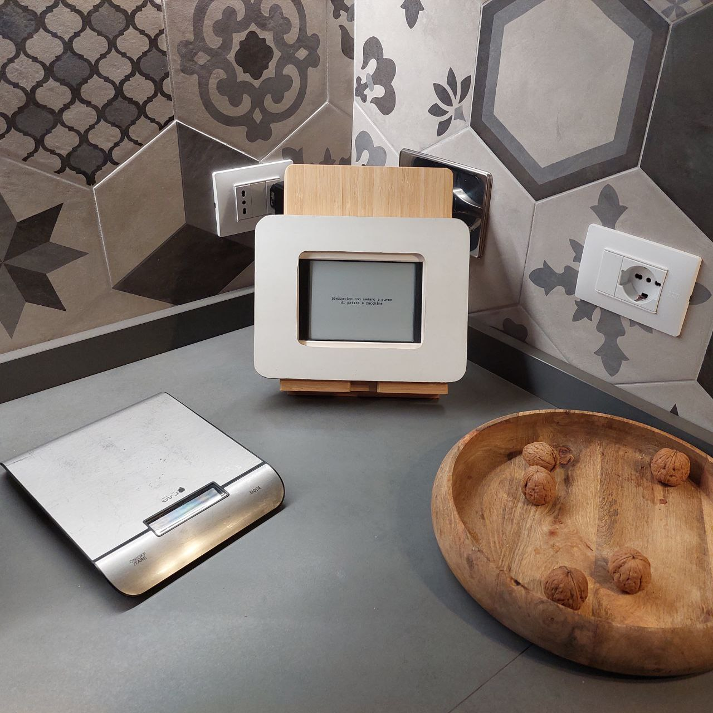

# Luncher :spaghetti:

Propose me what to do for lunch and dinner



## Infrastructure

The project is based on this tutorial:
[Turn an old eReader into an Information Screen](https://shkspr.mobi/blog/2020/02/turn-an-old-ereader-into-an-information-screen-nook-str/)

### Server side

Launching on the Pi the
[following command](https://elinux.org/RPi_HardwareHistory)

```
rev=$(awk '/^Revision/ { print $3 }' /proc/cpuinfo) && curl -L perturb.org/rpi?rev=$rev
```

I get:

```
Revision : 000e
Model    : B
Memory   : 512 MB
Overvolt : No
Released : Q4 2012
Notes    : (Mfg by Sony)
```

### Client side

- An NST: [Nook Simple Touch](https://en.wikipedia.org/wiki/Nook_Simple_Touch)
  rooted
- Elecric Signal App

# Build and deploy

This project uses the wonderful [Task](https://taskfile.dev/#/) for all the
operation:

## Build

```
task build:dev
```

## Run

```
task run:dev
```

## Deploy

Deploy happens on a Raspberry hosted in my local network

```
task deploy:target
```

## How to reboot nook every night to cleanup for (seems like many) memory leaks

```bash
0 4 * * * ssh -i /home/pi/.ssh/id_rsa -oKexAlgorithms=+diffie-hellman-group1-sha1 root@$(/sbin/arp -n | awk '/58:67:1a/ {print $1}') -t reboot > /tmp/reboot.log 2>&1
```
